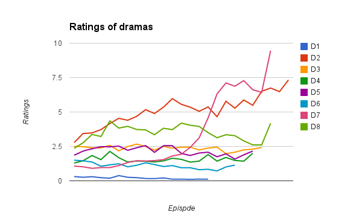
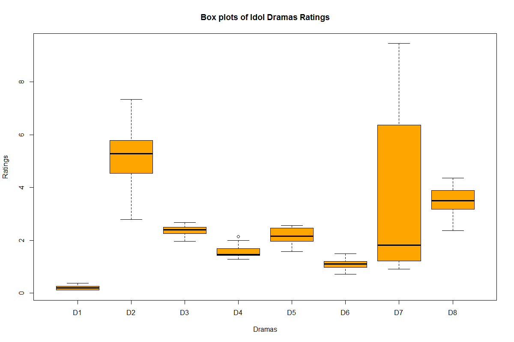

---
author:
- Ting-Wei Ku (Martin) \newline\newline
- Advisor — Prof. Shou-De Lin \newline\newline
- Committee — Prof. Pu-Jen Cheng, Ph.D. Cheng-Te Li
title: TV Ratings Prediction with \newline Time Weighting Based Regression (TWR)
subtitle: Master Thesis Defense
date: Feb 2, 2015
institute: National Taiwan University \newline Department of Computer Science & Information Engineering \newline Machine Discovery & Social Network Mining Lab
...

# Thesis Goal: Improve TV Ratings Prediction with NOVELTY

### Why TV ratings prediction?
It is an important, complex, and real-world problem with money.

- It's important because TV ratings decide **price of advertising time**.
- It's complex because...
    - TV ratings are **aggregate** measure of **many people's choices**.
    - TV is **competing** with many platforms/services (mobile/YouTube).

\note{
Story-perspective reason:
I've let Prof.Shou-De know that I want to solve real-world problem.
I was working a problem on Kaggle as my research: Online Product Sales.
One day, III asked Prof.Shou-De to help improve TV ratings prediction for SET.
So, Prof.Shou-De assigned III's request to me.
}

# Related Work

## 5 Works of TV Ratings Prediction

### TV Ratings Prediction (1/3)
- Forecasting television ratings \newline (IJF 2011, Danaher et al.)
    - Compared 8 regression models such as Bayesian model averaging
    - Suggested features such as seasonal factors and program genre
    - Found that modeling ratings directly is better than as total_audience×channel_share
    - Relatively large data: 5,000 programs and 48,000 ratings from 2004-2008
- Using a nested logit model to forecast television ratings \newline (IJF 2012, Danaher et al.)
    - Applied nested logit model to TV ratings prediction
    - Same relatively large data

Both works are not compared to ours due to key difference in data.

\note{
We do not consider them in our study due to different characteristic of data set in terms of TV programs.
Concretely, in their data set, many TV programs do not run continuously every day or week, 
and many programs (e.g., movies) are broadcast only once, so they have no time series information. 
On the other hand, in our data set, all TV programs are weekly dramas that have time series information.
}

### TV Ratings Prediction (2/3)
- Predicting TV audience rating with social media \newline (SocialNLP 2013, Hsieh et al.) \newline
  A predicting model of TV audience rating based on the Facebook \newline (SocialCom 2013, Cheng et al.)
    - Introduced Facebook features such as # of likes on the fan page
    - Fit data with neural network
    - 4 weekly dramas (78 ratings) broadcast in TW

#### Key difference between they and us
We only use historical ratings as features, i.e., no external features at all.

### TV Ratings Prediction (3/3)
- A weight-sharing gaussian process model using web-based information for audience rating prediction \newline (TAAI 2014, Huang et al.)
    - Proposed a novel GP model
    - Introduced Google Trends features (search-term frequency)
    - 4 daily dramas (336 ratings) broadcast in TW

#### Key difference between they and us
We only use historical ratings as features, i.e., no external features at all. \newline
Besides, we only focus on weekly dramas broadcast in TW.

# Solution: Time Weighting Based Regression (TWR)

## TWR Overview

### TWR Overview
\begin{alertblock}{Key idea of TWR}
  Fit regression model with time-weighted instances.
\end{alertblock}

- **Example**: Given x (x1,...,xN) is a time series of ratings,
    - (x1, x2, x3, x4=y4), t=4, weight=4
    - (x2, x3, x4, x5=y5), t=5, weight=5
    - (x3, x4, x5, x6=y6), t=6, weight=6
    - ...more weighted training instances
    - (x6, x7, x8, x9=y9), t=9, testing instance
- **Assumption**: Intuitively, newer instances are more important.

We'll show how **effective** this **simple** solution is via experiments later.

## Motivation: Exponential Smoothing
### Motivation: Exponential Smoothing
\begin{block}{Key idea of Exponential Smoothing (ES)}
  Forecast is the weighted average of past values, \newline
  and the weights decay exponentially as values get older.
\end{block}

\begin{alertblock}{Key idea of TWR}
  While ES weights on FEATURES decay as they get older, \newline
  TWR weights on INSTANCES decay as they get older.
\end{alertblock}

## How does TWR work?
### How does TWR work?
Pseudo-code of TWR is as below...

- **Input data**: a time series x with length N
- **Parameter**: window size w, growth function f, a base algorithm Learner with its parameters p

**Fitting process**:

1. Get instances via windowing transformation with window size w
2. Weigh instances with growth function f
3. Get base model m via fitting Learner with weighted instances

**Predicting process**: 

1. Get testing instance of one-step forecast from x
2. One-step forecast = Learner.Predict(m, testing instance)

## Deciding Parameters of TWR
### Deciding Parameters of TWR
- Window size
    - Decide via AIC (Akaike Information Criterion) for fair comparison
    - ARIMA pacakge decides its parameters via AICc.
- Growth function
    - 3 functions are considered: linear (t), exp (e\textsuperscript{t}), cubic exp (e\textsuperscript{3t})
    - Automatically select the one with min validation error
    - Borrow 1 validation instance from the last training instance
- Base algorithm and its parameters
    - Choose decision tree because it is sensitive to different data
    - Allow tree to grow as depth as possible
    - Prune the grown tree via validation error
    - `minsplit=2` (min # of instances on leaf for allowing split)

## Implementation of Weighting
### Implementation of Weighting
Q: Re-sample instances or infuse weights as cost? \newline
A: We choose the former because...

- Not all learning algorithms support instance weights.
- When combining with bagging, predictions are likely to be improved.

# Experiments

## What TV ratings to predict?
### What TV ratings to predict?
- **Data**: 8 real-world weekly dramas (170 ratings) broadcast in TW
    - Originally from SET but now also available at Wikipedia
- Predict next ratings of each drama (one-step forecasting)
- Start making predictions from the 6th episode

\note{
Why only 8 dramas?
Why weekly dramas?
Why start from the 6th episode?
}

## Data
### Time Series Plot of Data

### Box Plot of Data

### Basic Info of Data
Drama | # Episode | Start | Avg(ratings) | Std(ratings)
----- | --------- | ----- | ------------ | ------------
D1 | 16 | 2013/2/28 | 0.21 | 0.08
D2 | 25 | 2011/8/21 | 5.12 | 1.09
D3 | 22 | 2012/2/19 | 2.38 | 0.16
D4 | 21 | 2013/1/6 | 1.57 | 0.23
D5 | 21 | 2013/6/9 | 2.16 | 0.3
D6 | 19 | 2010/12/5 | 1.1 | 0.21
D7 | 23 | 2010/11/5 | 3.36 | 2.75
D8 | 23 | 2012/7/22 | 3.47 | 0.56

## Evaluation Metric
### Evaluation Metric
Two commonly used metrics in literature of TV ratings prediction:

- MAPE = avg(|actual-predicted| / actual)
- MAE = |actual-predicted| / actual

## Competitors (Other Models)
### Competitors (Other Models)
We compare our solution with 7 models:

- Previous period (PP)
- Past average (PA)
- Simple Exponential Smoothing (SES)
- Double Exponential Smoothing (DES)
- Exponential Smoothing State Space (ETS)
- Autoregressive Integrated Moving Average (ARIMA)
- Neural network auto-regression (NNA)

## TWR Settings
### TWR Settings
- TWR with no growth (TWR.N)
- TWR with linear growth (TWR.L)
- TWR with exponential growth (TWR.E)
- TWR with e\textsuperscript{3x} growth (TWR.E3)
- TWR with auto-selected growth (TWR.A)

## Results
### Results (MAPE %)
\small{}

|        | D1     | D2    | D3    | D4    | D5    | D6    | D7    | D8    | All       |
|--------|--------|-------|-------|-------|-------|-------|-------|-------|-----------|
| PP     | 24.27  | 8.53  | 8.59  | 13.95 | 12.65 | 12.63 | 13.07 | 8.98  | 12.18     |
| PA     | 60.17  | 19.37 | 6.47  | 10.72 | 13.98 | 20.77 | 46.09 | 13.75 | 22.48     |
| SES    | 32.47  | 8.21  | 6.33  | 11.94 | 12.35 | 12.57 | 13.07 | 8.90  | 12.22     |
| DES    | 30.16  | 8.41  | 6.88  | 18.59 | 15.15 | 12.66 | 12.15 | 13.22 | 13.77     |
| ETS    | 40.39  | 9.12  | 6.49  | 10.67 | 12.22 | 13.50 | 13.30 | 8.94  | 13.02     |
| ARIMA  | 34.12  | 8.34  | 7.18  | 10.72 | 13.02 | 13.01 | 13.58 | 9.58  | 12.64     |
| NNA    | 55.36  | 9.22  | 7.65  | 12.52 | 12.46 | 13.78 | 11.71 | 10.81 | 14.78     |
| TWR.N  | 56.93  | 14.75 | 6.49  | 12.82 | 13.43 | 17.61 | 36.59 | 11.51 | 19.72     |
| TWR.L  | 44.23  | 11.30 | 6.61  | 11.88 | 12.41 | 15.43 | 27.51 | 11.12 | 16.35     |
| TWR.E  | 25.60  | 7.65  | 7.91  | 11.93 | 11.22 | 12.69 | 15.88 | 8.52  | 11.97     |
| TWR.E3 | 24.28  | 8.39  | 8.42  | 13.58 | 12.55 | 12.63 | 13.34 | 8.84  | 12.09     |
| TWR.A  | 25.47  | 7.86  | 7.59  | 10.81 | 12.11 | 11.67 | 13.44 | 8.97  | **11.54** |

### Results (MAE)
\scriptsize{}

|        | D1     | D2     | D3     | D4     | D5     | D6     | D7     | D8     | All        |
|--------|--------|--------|--------|--------|--------|--------|--------|--------|------------|
| PP     | 0.0518 | 0.4775 | 0.1965 | 0.2250 | 0.2569 | 0.1286 | 0.5950 | 0.3272 | 0.3044     |
| PA     | 0.0882 | 1.1048 | 0.1439 | 0.1681 | 0.2764 | 0.1900 | 2.3341 | 0.4646 | 0.6589     |
| SES    | 0.0598 | 0.4604 | 0.1410 | 0.1909 | 0.2520 | 0.1280 | 0.5950 | 0.3202 | 0.2893     |
| DES    | 0.0627 | 0.4644 | 0.1589 | 0.2880 | 0.3158 | 0.1370 | 0.5679 | 0.4904 | 0.3331     |
| ETS    | 0.0686 | 0.5068 | 0.1447 | 0.1675 | 0.2504 | 0.1381 | 0.6249 | 0.3213 | 0.3000     |
| ARIMA  | 0.0576 | 0.4573 | 0.1608 | 0.1681 | 0.2628 | 0.1318 | 0.6124 | 0.3412 | 0.2955     |
| NNA    | 0.0955 | 0.5232 | 0.1731 | 0.1943 | 0.2442 | 0.1348 | 0.5031 | 0.3669 | 0.3002     |
| TWR.N  | 0.0836 | 0.8287 | 0.1444 | 0.1973 | 0.2644 | 0.1606 | 1.6678 | 0.3880 | 0.5122     |
| TWR.L  | 0.0695 | 0.6435 | 0.1480 | 0.1854 | 0.2458 | 0.1441 | 1.1960 | 0.3714 | 0.4099     |
| TWR.E  | 0.0510 | 0.4335 | 0.1800 | 0.1915 | 0.2286 | 0.1283 | 0.6919 | 0.3035 | 0.2979     |
| TWR.E3 | 0.0515 | 0.4699 | 0.1928 | 0.2190 | 0.2550 | 0.1288 | 0.6055 | 0.3208 | 0.3023     |
| TWR.A  | 0.0497 | 0.4429 | 0.1712 | 0.1756 | 0.2440 | 0.1173 | 0.6094 | 0.3248 | **0.2883** |

### Discussion (Competitors)
- PP is a challenging baseline.
- PA performs badly, which indicates older ratings are not important.
- SES performs well because ratings lack of seasonal/trend pattern.
- NNA performs normally overall, but its predictions of D7 are the best.

### Discussion (TWR)
- Results of TWR.N, TWR.L and TWR.E indicate as weighing more on the newer instances, the better results we get.
- Results of TWR.E3 are mixed, which indicates it's important to find the best growth function.
- Results of TWR.A improves 8% MAPE from TWR.N and outperforms all models overall, which indicates the effectiveness of our idea.

# Conclusion

### Contributions and Future Work
Contributions:

- Propose TWR, which is a novel, simple, effective, and extensible solution to TV ratings prediction.
- Evaluate effectiveness of TWR via real-world data.

Future work:

- Find better growth functions in better ways.
- Test TWR with more data.

----
\begin{center}
  \Huge{Thank you!}
\end{center}
