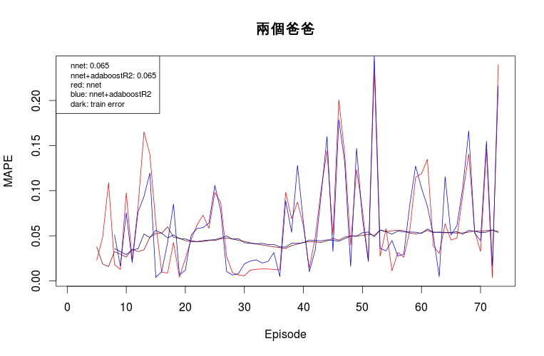
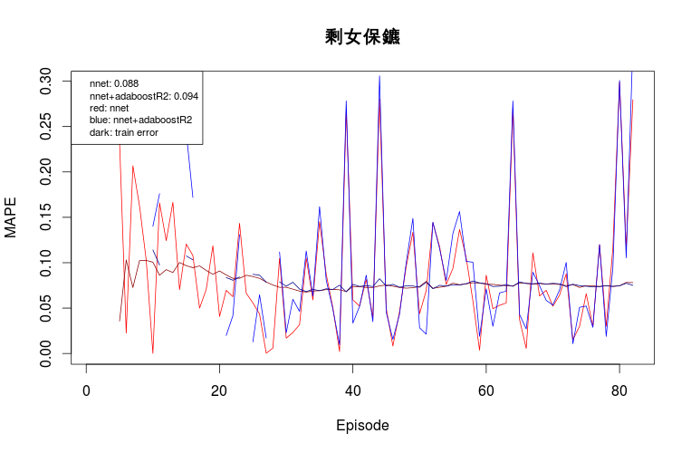
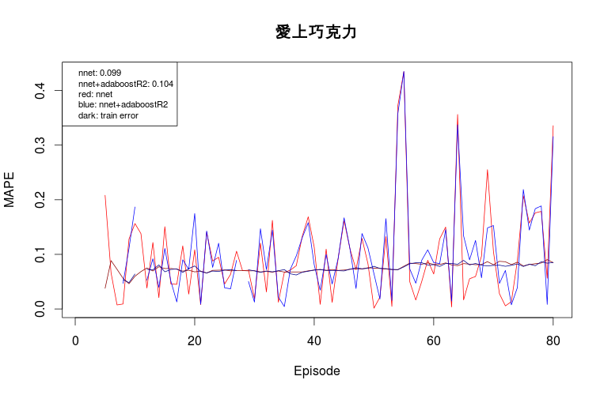
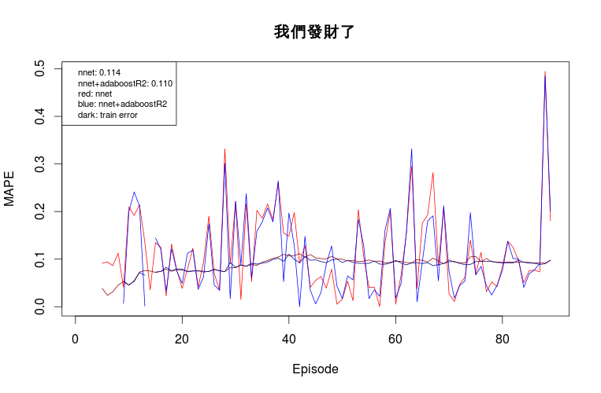
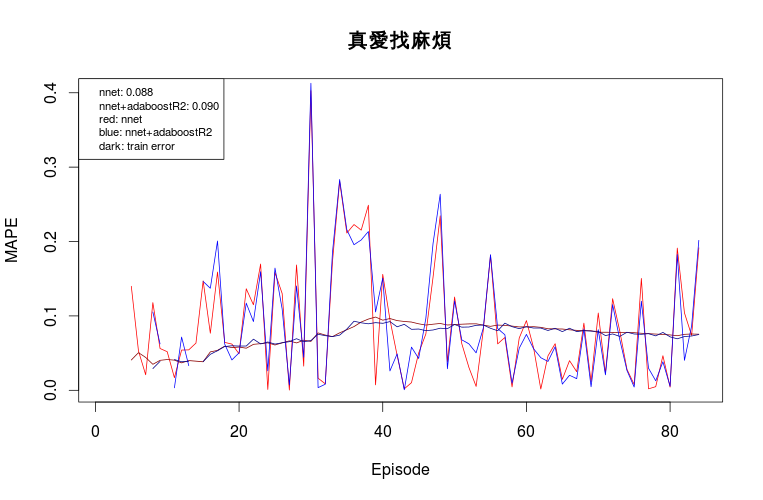
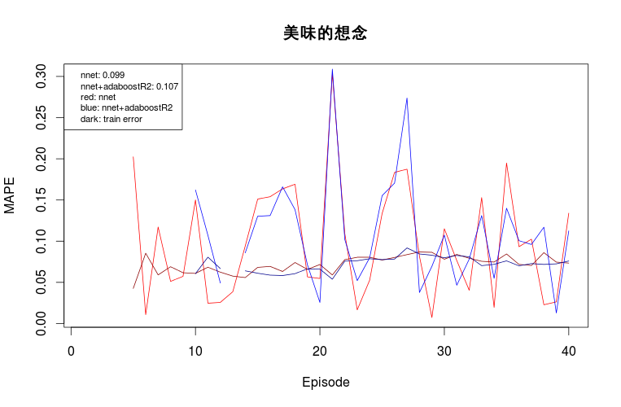

# nnet + AdaBoostR2
## Chinese Drama
### Parameter Settings
- 1 hidden layer
- # of hidden units equals to # of input features
- rang=0.1; decay=1e-1; maxit=100
- seed=0

### Result Summary
Drama | Model | Before | After adding time period
------|-------|--------|--------------------------
兩個爸爸   | nnet    | 0.086 | 0.065 :+1:
兩個爸爸   | nnet+R2 | 0.086 | 0.065 :+1:
剩女保鏢   | neet    | 0.084 | 0.088
剩女保鏢   | neet+R2 | 0.081 | 0.094
愛上巧克力 | nnet    | 0.099 | 0.099
愛上巧克力 | nnet+R2 | 0.102 | 0.104
我們發財了 | nnet    | 0.108 | 0.114
我們發財了 | nnet+R2 | 0.107 | 0.110
真愛找麻煩 | nnet    | 0.096 | 0.088 :+1:
真愛找麻煩 | nnet+R2 | 0.093 | 0.090 :+1:
美味的想念 | nnet    | 0.098 | 0.099
美味的想念 | nnet+R2 | 0.097 | 0.107

### Result Detail

