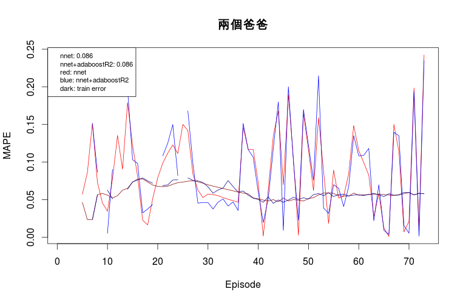
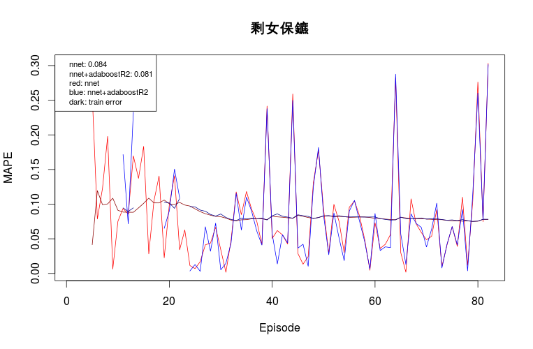
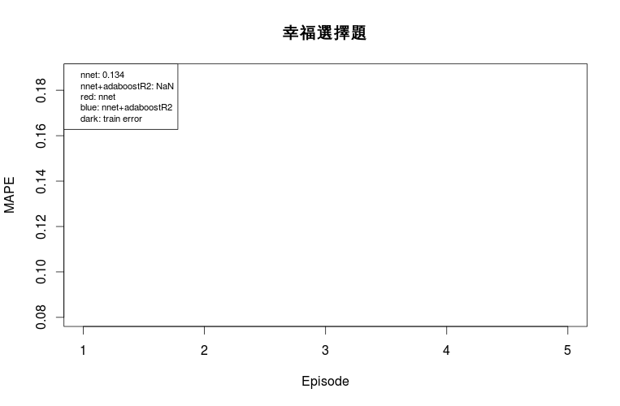
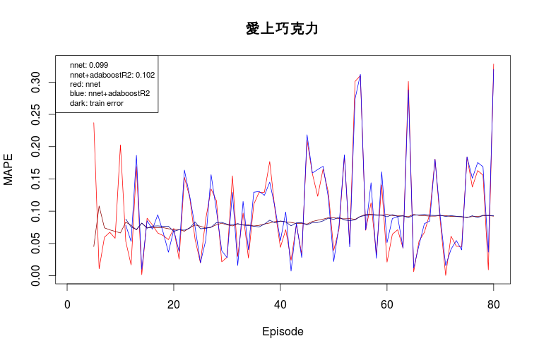
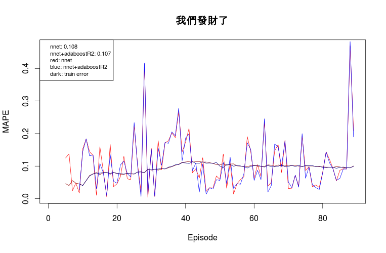
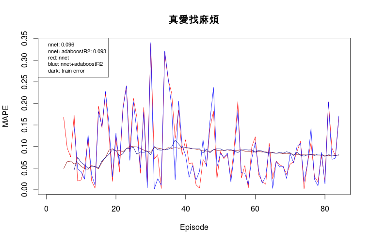
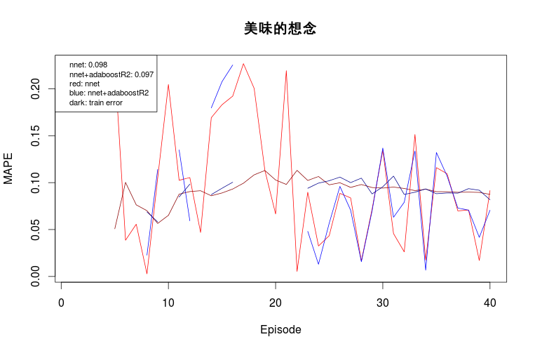

# nnet + AdaBoostR2
## Chinese Drama
### Parameter Settings
- 1 hidden layer
- # of hidden units equals to # of input features
- rang=0.1; decay=1e-1; maxit=100
- seed=0

### Result Summary
- Performance improvement after boosting:
  - 剩女保鏢: `0.84` to `0.81`
  - 我們發財了: `0.108` to `0.107`
  - 真愛找麻煩: `0.096` to `0.093`
  - 美味的想念: `0.098` to `0.097`
- No performance improvement after boosting:
  - 兩個爸爸
- Performance decrease after boosting:
  - 愛上巧克力: `0.099` to `0.102`

### Result Detail

